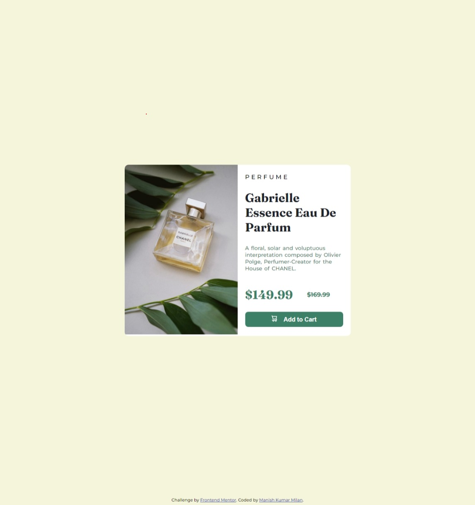

# Frontend Mentor - Product preview card component solution

This is a solution to the [Product preview card component challenge on Frontend Mentor](https://www.frontendmentor.io/challenges/product-preview-card-component-GO7UmttRfa). Frontend Mentor challenges help you improve your coding skills by building realistic projects.

## Table of contents

- [The challenge](#the-challenge)
- [Screenshot](#screenshot)
  - [Links](#links)
- [My process](#my-process)
  - [Built with](#built-with)
- [Author](#author)

### The challenge

Users should be able to:

- View the optimal layout depending on their device's screen size
- See hover and focus states for interactive elements

### Screenshot

### Links

- Solution URL: [Add solution URL here](https://your-solution-url.com)
- Live Site URL: [Add live site URL here](https://your-live-site-url.com)

## My process

- At first I, created basic html layout.
- I divided the challenge into two parts part1 and part2.
- After that, I designed each part with the help of flexbox and different CSS properties.

- At last, I used media queries for mobile layout, I simply changed flex-direction to column.

### Built with

- Semantic HTML5 markup
- CSS custom properties
- Flexbox

### Useful resources

- (https://www.w3schools.com/css/default.asp) - This website helped me in finding right syntax and of CSS ans HTML. This is my go to website for HTML and CSS concept.

- (https://css-tricks.com/snippets/css/a-guide-to-flexbox/) - This is an amazing article which helped me finally understand flexbox. I'd recommend it to anyone still learning this concept.

## Author

- Website - [Add your name here](https://www.your-site.com)
- Frontend Mentor - [@mkm0702](https://www.frontendmentor.io/profile/mkm0702)
- Twitter - [@mkm16207](https://twitter.com/mkm16207)
